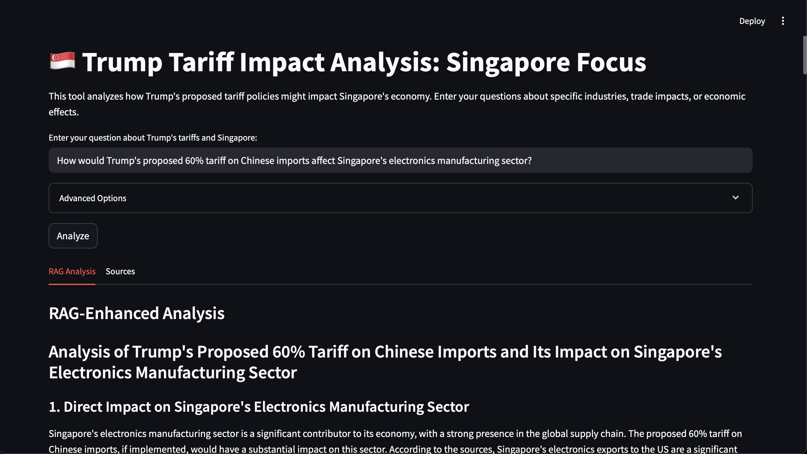

# Tariff GPT

It's April 2025, and DJT has announced an extensive tariffs plan on many economies. As a Singaporean, I'm similarly shocked that we are hit with a 10% tariff even despite of the healthy relationship between these two countries.

Tariff-GPT is my attempt to use AI to understand these tariffs and their impact on Singapore. I will be detailing my steps in data collection, data processing and RAG.

## Data collection
Given the small dataset that I wanted to collect, I manually googled and scraped news articles covering Trump's tariffs. Here is the breakdown of article types:
- 4 articles on general Trump tariff policies
- 5 articles specifically analyzing Singapore impact
- 4 articles on broader Asia/ASEAN implications
- 2 expert opinion pieces/editorials

I collected these articles from a variety of sources, including CNA and The Straits Times for Singapore coverage, and Bloomberg/Financial Times for global coverage.

## Data processing
After collecting the news articles, I processed them for better performance in RAG:
- Implement document chunking with strategic overlap: Chunk each article into smaller "pieces" so that our model is able to better focus. Given the 128k context length of Ministral 3B and the short length of each article, this turned out to be less useful. However, I kept this component for robustness should longer articles/books be introduced into the database.
- Extract metadata from sources (date, source credibility, topic focus): While this is less relevant as we manually curated our data, this could be useful when we adopt an agentic approach where the agent can browse the web for news sources.
- Create custom preprocessing for financial/economic text: Text cleaning to help standardise the formatting differences across financial texts.
- Metadata Preservation in Chunks: This allows our model to correctly attribute the data source that it came from.

Our code for data processing is in `rag/document_processor.py` and the script for running it is in `scripts/ingest_documents.py`. Processed documents are stored in a json file in `data/processed`. Due to the smaller size of each article and the 128k context window of Ministral 3B, each article is just one chunk post-processing.

## RAG Implementation
Our RAG implementation involves four components:
1. Hybrid Retrieval (BM25 + Dense Embeddings)
- Due to the nature of economic/financial reporting, the usage of such a hybrid retrieval technique can help to better preserve and understand the information.
- BM25 focuses on keyword matching, while dense embeddings focuses on semantic matching.
- BM25 better preserves numerical values, while a 70/30 dense-BM25 embedding weighting still favours semantic understanding and maintain catching key terms.
- Example: A query about "impact of tariffs on electronics exports" will match documents mentioning "semiconductor manufacturing" (semantic) and "60% tariff" (lexical).
2. Query Rewriting for Economic Questions
- A common feature of RAG systems is rewriting the query to capture as many variations of the question as possible. This allows us to catch the answer even if it was expressed differently. In this case, we included domain-specific expansion for relevant economic terminology, industry recognition for relevant sectors, and synonym generation for variations in how economic concepts are expressed.
- Example: Transforms "How will tariffs affect Singapore?" into "How will Trump's proposed tariffs impact Singapore's economy, trade balance, export sectors including electronics, manufacturing, pharmaceutical industries, and GDP growth?"
3. Contextual compression
- This prioritises relevant information, including extracting key passages, tariff impact information over general economic background, and specific data extractions.
- While our context may be shorter due to the nature of news articles, this allows our RAG implementation to be robust for longer content in the future.
- Example: From a long economic report, extracts only the paragraphs specifically discussing Singapore's electronics supply chain vulnerability to Chinese import tariffs.
4. Source attribution tracking
- A key advantage of RAG is source attribution, which allows for claim verification, credibility assessment and illustrates conflicting perspectives (if any).

In short, we are customising our RAG implementation specifically for economic/tariff analysis.

## Evaluation
I've implemented LLM as a judge to evaluate the improvement in the RAG-augmented answer quality. I opted to use Mistral's `mistral-large-latest` as the LLM judge, and kept the same base model `ministral-3b-latest` with the same temperature as the base response. 

### Evaluation process
1. Test Dataset Creation: I created a set of 10 questions covering different aspects of Trump's tariffs and their impact on Singapore, categorised by their focus area. The questions can be found in `evaluation/test_questions.py`.
2. Dual response generation: For each question, both the base model and the RAG-augmented model will respond. The RAG-augmented model has access to document retrieval, query rewriting and source attribution.
3. Structured scoring: The LLM judge then evaluates both responses on multiple dimensions, including relevance, factual correctness and source usage.

### Evaluation metrics
The evaluation system uses a multi-faceted scoring system (1-10 scale) across five key dimensions:

| Metric | Description |
|--------|-------------|
| **Factual Correctness** | Accuracy and support from reliable sources |
| **Relevance** | Direct addressing of the query's intent |
| **Comprehensiveness** | Breadth and depth of the response |
| **Source Usage** | Effective integration and citation of relevant sources |
| **Singapore Specificity** | Focus on Singapore's unique economic context |

### Key findings
Our evaluation revealed significant improvements when using the RAG approach:
- Across all 10 questions and answers pairs, our LLM judge prefers the RAG-augmented answer over the base model's answer.
- Our RAG-augmented answer also scores consistently high (>9/10) on metrics like factual-correctness, relevance and source usage. 
- An example of the LLM judge's critique on the RAG-augmented answer is as follow:
>"evaluation": {
      "factual_correctness": {
        "score": 9,
        "explanation": "The candidate answer is well-supported with specific data and references to sources, making it highly accurate."
      },
      "relevance": {
        "score": 9,
        "explanation": "The answer directly addresses the question by discussing the impact of Trump's tariffs on Singapore's economy and its role as a regional trade hub."
      },
      "comprehensiveness": {
        "score": 8,
        "explanation": "The answer covers a wide range of impacts, including potential benefits, industry-specific effects, and government responses. However, it could benefit from a more detailed discussion on the potential for job losses and the impact on financial services, as mentioned in the reference answer."
      },
      "source_usage": {
        "score": 10,
        "explanation": "The candidate answer effectively cites and uses multiple sources to support its claims, providing specific data and insights."
      },
      "singapore_specificity": {
        "score": 9,
        "explanation": "The answer is highly focused on Singapore's context, discussing the country's trade relations, specific industries, and government responses."
      },
      "overall": {
        "score": 9,
        "summary": "The candidate answer is highly accurate, relevant, and well-supported with sources. It provides a comprehensive overview of the impacts of Trump's tariffs on Singapore, although it could include more details on certain aspects like job losses and financial services. The use of sources significantly enhances the credibility of the answer.",
        "is_improvement": true
      }
    }

## Weaknesses
While the RAG augmented implementation illustrates that small 3B models can perform very well on answering factual questions, a major limitation of this implementation is how fast the data sources can get updated. To mitigate this, an agentic approach could be used where agents will visit the web at fixed intervals (e.g. every 2 hours), search for relevant news articles, and update our database with the news article. Older articles in our database can also be periodically removed to ensure that latest information is delivered. To that end this implementation can be extended with agentic features via the `agents` folder.